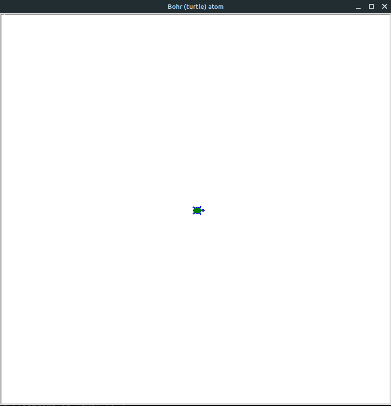
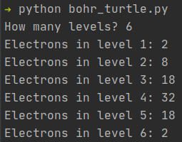

# Bohr model (with turtles)

Atomick Sanchez: *"Boom! Big reveal! I'm a turtle! I'm a turtle aaaaaatooom""*



## Installation

Just clone or download this repo. This is not a package (yet, maybe someday :-))

## Usage

The project has a command line interface (CLI) managed by a script named `bohr_turtle.py`. In the terminal prompt:

```bash
$ python bohr_turtle.py
```

Follow the instructions in the screen, inserting how many levels do you want and how many electrons in each level. The gif at the beginning of this README is for a mercury atom, so:



A window will show with the animated turtle drawing each level. After the drawing is finished, just click the window to go back to the terminal.

## Under the hood - requirements

Python 3.6 or higher. The [`turtle` module](https://docs.python.org/3/library/turtle.html) is part of the standard library.

## Contributing

All contributions are welcome.

**Issues**

Feel free to submit issues regarding:

- recommendations
- more examples
- enhancement requests and new useful features
- code bugs

**Pull requests**

- before starting to work on your pull request, please submit an issue first
- fork the repo
- clone the project to your own machine
- commit changes to your own branch
- push your work back up to your fork
- submit a pull request so that your changes can be reviewed

## License

MIT, see [LICENSE](LICENSE)

## Citing

If you use this project in a scientific publication or in classes, please consider citing as

F. L. S. Bustamante, Bohr model (with turtles), 2020 - Available at: https://github.com/chicolucio/bohr-model-turtle